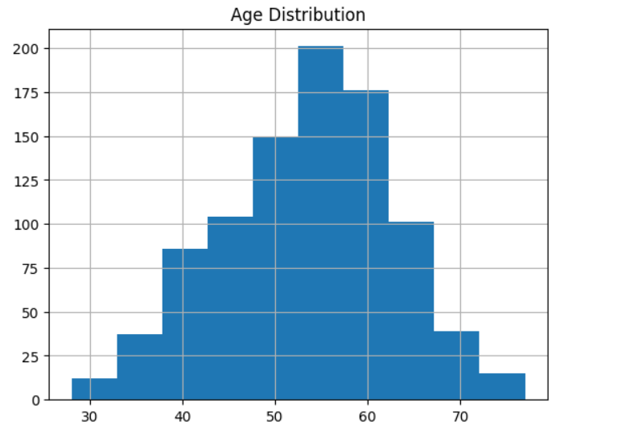
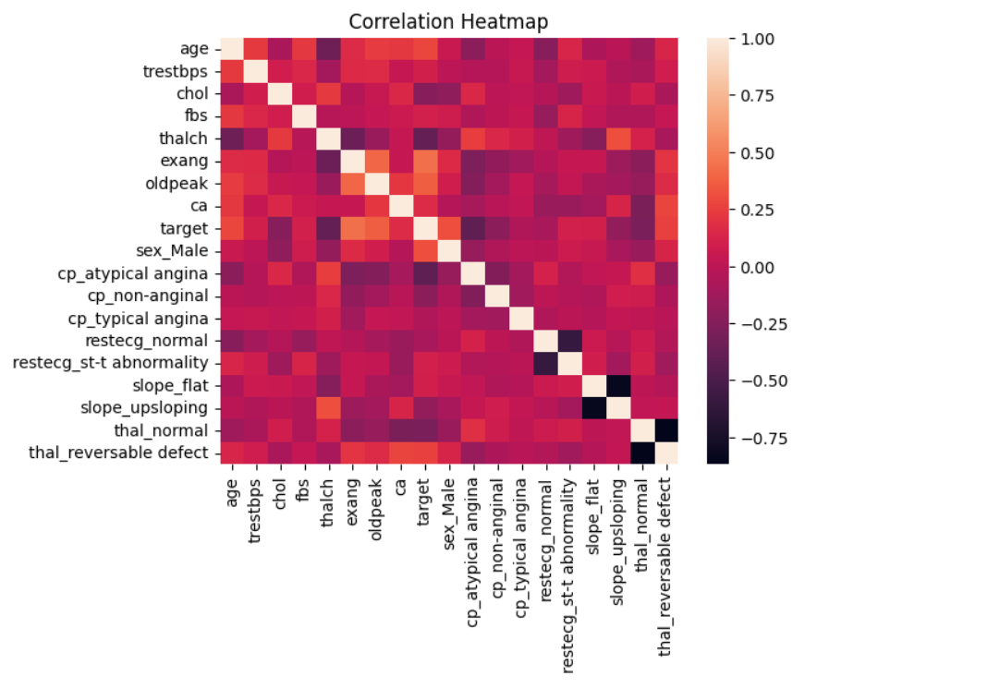

# 🩺 Heart Disease Prediction using Machine Learning

## 🚀 Overview
Heart disease is one of the leading causes of death worldwide. Early detection can significantly improve treatment outcomes and reduce risk.

This project builds a machine learning-based prediction system to classify whether a patient is at risk of heart disease using clinical and medical attributes.

---

## 🎯 Objective
To develop a robust classification model that predicts the likelihood of heart disease using patient data such as age, cholesterol levels, chest pain type, and other medical indicators.

---

## 📊 Dataset
- Source: UCI Machine Learning Repository  
- Total Records: 920  
- Features: 16  

### Key Attributes:
- Age  
- Sex  
- Chest Pain Type (cp)  
- Resting Blood Pressure (trestbps)  
- Cholesterol (chol)  
- Fasting Blood Sugar (fbs)  
- ECG Results (restecg)  
- Maximum Heart Rate (thalach)  
- Exercise-Induced Angina (exang)  

---

## 🔄 Data Preprocessing
- Converted multi-class target (`num`) into binary classification:
  - `0 → No Disease`
  - `1 → Disease`
- Handled missing values:
  - Numerical → Median imputation  
  - Categorical → Mode imputation  
- Encoded categorical variables using one-hot encoding  
- Applied feature scaling using StandardScaler  

---

## 🤖 Machine Learning Models
The following classification algorithms were implemented and compared:

- Logistic Regression  
- Support Vector Machine (SVM)  
- Random Forest  
- XGBoost  

---

## 📈 Model Performance

| Model | Accuracy |
|------|---------|
| Logistic Regression | 0.7989130434782609 |
| SVM | 0.842391304347826 |
| Random Forest | 0.8532608695652174 |
| XGBoost | 0.875 |

👉 Best Model: Random Forest / XGBoost (based on highest accuracy & F1-score)

---

## 🔍 Feature Importance
Using Random Forest, the most influential features identified were:

- Chest Pain Type  
- Cholesterol Level  
- Maximum Heart Rate  
- ST Depression (oldpeak)  

These features play a critical role in predicting heart disease.

---

## 🧪 Prediction System

A prediction function was implemented to classify new patient data:

predict_heart_disease(input_data)

### Output:
- Low Risk (No Disease)  
- High Risk (Disease)  

---

## 📊 Exploratory Data Analysis
- Distribution plots for key features
   
- Correlation heatmap
   
- Feature importance visualization
   

---

## 🛠️ Technologies Used
- Python  
- Pandas  
- NumPy  
- Scikit-learn  
- XGBoost  
- Matplotlib  
- Seaborn  

---

## 🚀 Final Results

- Best Model: Random Forest
- Accuracy: 87%
- F1 Score: 85%

## 🏁 Conclusion
This project demonstrates the application of machine learning in healthcare for early detection of heart disease.This project demonstrates end-to-end machine learning pipeline from data preprocessing to prediction.

By comparing multiple models and analyzing feature importance, the system provides meaningful insights that can assist in medical decision-making.

---

## 💡 Future Improvements
- Hyperparameter tuning for better accuracy  
- Deployment using web frameworks  
- Integration with real-time healthcare systems  

---

## 👩‍💻 Author
Siri Chandana Byra  
AIML Student | Machine Learning Enthusiast 🚀
